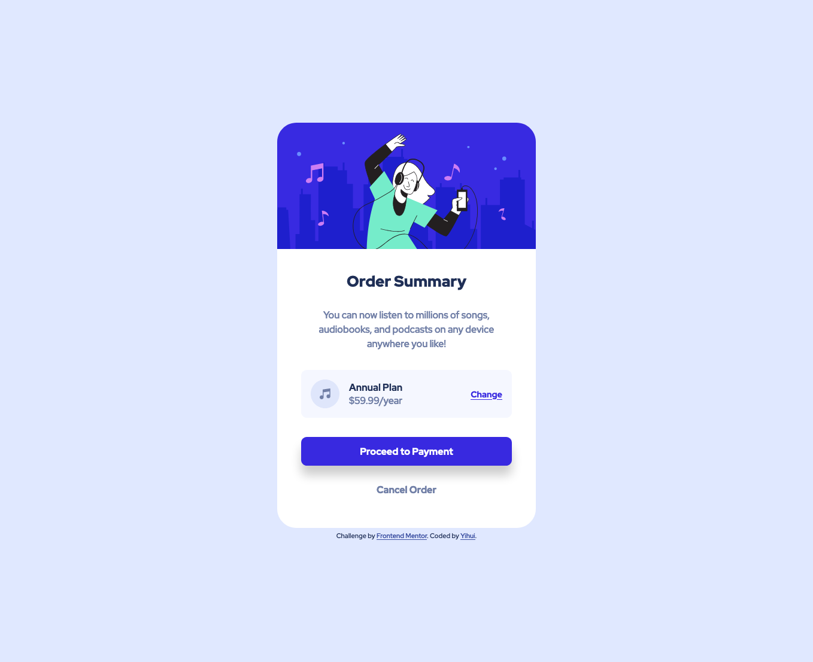

# Frontend Mentor - Order summary card solution

This is a solution to the [Order summary card challenge on Frontend Mentor](https://www.frontendmentor.io/challenges/order-summary-component-QlPmajDUj). Frontend Mentor challenges help you improve your coding skills by building realistic projects. 


## Table of contents

- [Frontend Mentor - Order summary card solution](#frontend-mentor---order-summary-card-solution)
  - [Table of contents](#table-of-contents)
  - [Overview](#overview)
    - [The challenge](#the-challenge)
    - [Screenshot](#screenshot)
    - [Links](#links)
  - [My process](#my-process)
    - [Built with](#built-with)
    - [What I learned](#what-i-learned)
    - [Continued development](#continued-development)
  - [Author](#author)
  - [Acknowledgments](#acknowledgments)

## Overview

### The challenge

Users should be able to:

- See hover states for interactive elements

### Screenshot



### Links

- Solution URL: [https://github.com/Huizz/d3-flg/tree/master/2-order-summary-component-main](https://github.com/Huizz/d3-flg/tree/master/2-order-summary-component-main)
- Live Site URL: [https://huizz.github.io/d3-flg/2-order-summary-component-main/](https://huizz.github.io/d3-flg/2-order-summary-component-main/)

## My process

### Built with

- Semantic HTML5 markup
- CSS custom properties
- Flexbox
- Mobile-first workflow

### What I learned

- Use CSS reset to remove browser stylesheet styles
```
body,
main,
h1,
p,
div,
a,
button {
  margin: 0;
  padding: 0;
  border: 0;
  font-size: 100%;
  font: inherit;
  vertical-align: baseline;
  font-family: inherit;
}
```
- Use landmarks
```
<main>...</main>
<footer>...<footer>
```
- Using box-shadow to create shadow effect for elements

### Continued development

- Improve accessibility of the page

## Author

- Website - [Yihui](https://github.com/Huizz)
- Frontend Mentor - [@Huizz](https://www.frontendmentor.io/profile/Huizz)


## Acknowledgments

Thank you Dave for leading the frontend learning group.
Thank you members of the frontend learning group for actively participating and providing feedback