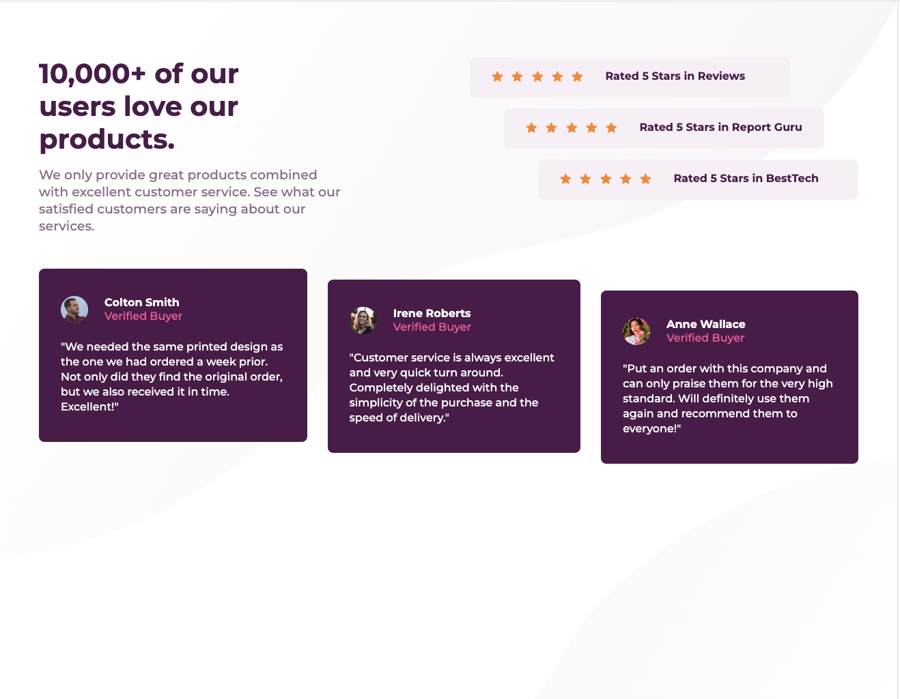

# Frontend Mentor - Social proof section solution

This is a solution to the [Social proof section challenge on Frontend Mentor](https://www.frontendmentor.io/challenges/social-proof-section-6e0qTv_bA). Frontend Mentor challenges help you improve your coding skills by building realistic projects. 

## Table of contents

- [Frontend Mentor - Social proof section solution](#frontend-mentor---social-proof-section-solution)
  - [Table of contents](#table-of-contents)
  - [Overview](#overview)
    - [The challenge](#the-challenge)
    - [Screenshot](#screenshot)
    - [Links](#links)
  - [My process](#my-process)
    - [Built with](#built-with)
    - [What I learned](#what-i-learned)
    - [Continued development](#continued-development)
  - [Author](#author)
  - [Acknowledgments](#acknowledgments)

**Note: Delete this note and update the table of contents based on what sections you keep.**

## Overview

### The challenge

Users should be able to:

- View the optimal layout for the section depending on their device's screen size

### Screenshot

### Links

- Solution URL: [https://github.com/Huizz/d3-flg/tree/master/5-social-proof-section-master](https://github.com/Huizz/d3-flg/tree/master/5-social-proof-section-master)
- Live Site URL: [https://huizz.github.io/d3-flg/5-social-proof-section-master/](https://huizz.github.io/d3-flg/5-social-proof-section-mastert/)

## My process

### Built with

- Semantic HTML5 markup
- CSS custom properties
- Flexbox
- Mobile-first workflow

### What I learned

### Continued development

## Author

- Website - [Yihui](https://github.com/Huizz)
- Frontend Mentor - [@Huizz](https://www.frontendmentor.io/profile/Huizz)

## Acknowledgments

Thank you Dave for leading the frontend learning group.
Thank you members of the frontend learning group for actively participating and providing feedback
